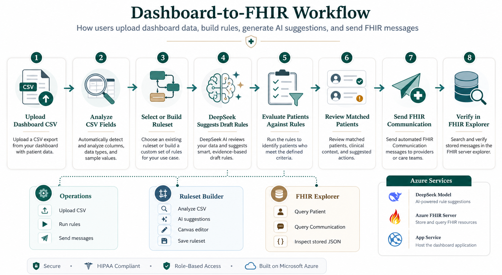
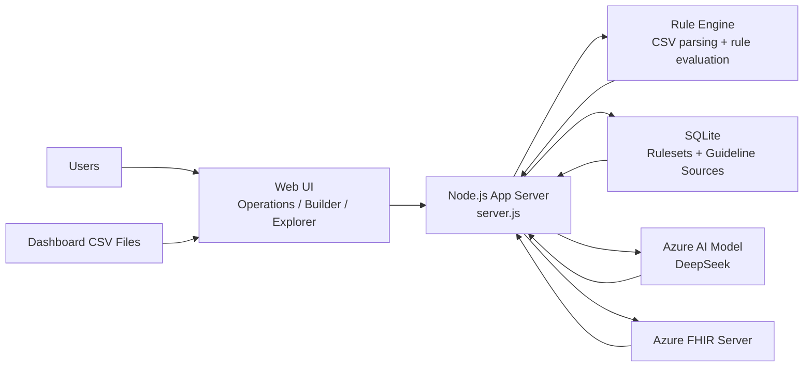

# Dashboard-to-FHIR Communication App

This repository contains a health informatics demo application that turns external population-health dashboard CSVs into actionable FHIR-based clinical communications. The app combines three major workflows:

- `Operations`: upload a dashboard CSV, run a saved ruleset, review matched patients, and send FHIR `Communication` resources
- `Ruleset Builder`: analyze a CSV, generate AI-assisted rule suggestions, edit logic in a visual canvas, and save reusable rulesets to SQLite
- `FHIR Explorer`: query the connected FHIR server directly to inspect `Patient`, `Communication`, and related resources

The project is designed as a working prototype that others can fork, adapt, and extend into a stronger integration with Azure FHIR, SMART on FHIR, or production-grade clinical rule services.

## Workflow Overview



## What the App Does

The application solves a common population-health workflow problem: dashboards often live outside the EHR, so staff identify patients manually and then must re-enter recommendations one chart at a time. This app reduces that friction by:

1. Reading dashboard CSV exports from external systems
2. Applying reusable rulesets against patient rows
3. Identifying matched patients and the reason they matched
4. Generating FHIR `Communication` resources that can be sent to a FHIR server
5. Providing a Builder for creating new rulesets with curated medical guidance and Azure AI support
6. Providing an Explorer to verify what exists in the FHIR server

## Main Features

### Operations

- Upload a dashboard CSV
- Select an active ruleset stored in SQLite
- Run the rule engine against the uploaded file
- Review matched patients and their recommended message
- Preview the generated FHIR JSON
- Send FHIR `Communication` resources to a configured FHIR server

### Ruleset Builder

- Upload a CSV for analysis
- Auto-detect likely clinical domains based on CSV structure
- Use DeepSeek-backed Azure AI suggestions
- View AI rationale and grounded source information
- Build rules visually with nested `AND`, `OR`, and `NOT` logic
- Save rulesets into SQLite for reuse in Operations
- Manage trusted clinical guideline sources across domains

### FHIR Explorer

- Query the connected FHIR server by resource type and patient ID
- Run custom relative FHIR query paths
- Inspect returned JSON directly in the app
- Verify submitted `Communication` resources

## Clinical Domains Included

The current seeded rules and guideline library support these domains:

- Colon cancer screening
- Lung cancer screening
- ASCVD prevention
- Asthma
- Cirrhosis management
- Diabetes
- Adult immunizations
- Chronic kidney disease
- COPD
- Cervical cancer screening
- Heart failure
- Hepatitis B

## System Architecture



## Repository Structure

- `server.js`: API routes, FHIR submission/query logic, Azure identity usage, static file serving
- `lib/rule-engine.js`: CSV parsing, rule evaluation, FHIR `Communication` generation
- `lib/rules-db.js`: SQLite persistence layer
- `lib/seed-rules.js`: seeded rules, profile detection, curated suggestion templates
- `lib/guideline-library.js`: trusted guideline/source seed data
- `lib/llm-suggestions.js`: Azure AI prompt construction, request handling, AI suggestion normalization
- `public/index.html`: UI structure for all three app views
- `public/app.js`: frontend state, rendering, interactions, API calls
- `public/styles.css`: application styling
- `docs/assets/dashboard-to-fhir-workflow.png`: workflow graphic for the project

## Running Locally

### Requirements

- Node.js 22 recommended
- npm
- Azure CLI only if you plan to test live Azure FHIR access locally

### Start the App

```bash
npm install
npm start
```

Then open:

- [http://localhost:3000](http://localhost:3000)

## Azure Configuration

### App Service

This app is structured to run on Azure App Service with:

- Node.js runtime
- `npm start`
- GitHub Actions deployment

### Azure AI

DeepSeek is the active AI provider exposed in the UI. The app expects Azure App Service environment variables like:

- `AZURE_OPENAI_DEEPSEEK_ENDPOINT`
- `AZURE_OPENAI_DEEPSEEK_API_KEY`
- `AZURE_OPENAI_DEEPSEEK_DEPLOYMENT`
- `AZURE_OPENAI_DEEPSEEK_API_VERSION`

### FHIR Server

The backend reads the default FHIR server from:

- `FHIR_SERVER_URL`

The app can also send to a user-provided FHIR server URL from the Operations view.

### Managed Identity

If the app is querying or writing to Azure FHIR from App Service, the App Service managed identity must be granted the appropriate FHIR data roles, such as:

- read access for Explorer
- write access for message submission

## How the Workflows Fit Together

### Operations Flow

1. Upload dashboard CSV
2. Choose active ruleset
3. Run rules
4. Review matched patients
5. Preview FHIR `Communication` JSON
6. Send messages to FHIR server

### Builder Flow

1. Upload CSV
2. Analyze schema
3. Optionally enable Azure AI suggestions
4. Review curated and AI-generated suggestions
5. Load a suggestion into the canvas
6. Edit logic and message metadata
7. Save ruleset to SQLite
8. Reuse it later in Operations

### Explorer Flow

1. Choose FHIR server
2. Select resource type or custom path
3. Query patient/resource data
4. Inspect stored JSON

## AI Behavior

The app does not rely on AI alone to execute rules. Instead:

- AI suggests draft rules
- the user reviews them
- saved rules become deterministic JSON rules
- the rule engine executes those saved rules consistently

The app also exposes an AI rationale dialog so users can inspect:

- the model/provider used
- the rationale text
- the grounding source
- the proposed rule JSON

## Data Persistence

Rulesets and guideline sources are stored in SQLite using `sql.js`.

This is appropriate for a demo or single-instance deployment, but it is not intended as a final production database architecture.

## Extension Ideas

This project is a strong starting point for future work. Good next steps include:

- replace SQLite with a production database
- integrate richer FHIR resource types beyond `Communication`
- support SMART on FHIR authorization patterns
- connect to more live clinical knowledge sources
- add versioning and approval workflows for rulesets
- add more FHIR server query presets in Explorer

## Notes for Contributors

If you fork this repository, the most important places to start are:

- `public/app.js` for UI behavior
- `server.js` for API and Azure integration
- `lib/llm-suggestions.js` for AI behavior
- `lib/rule-engine.js` for rule execution
- `lib/seed-rules.js` and `lib/guideline-library.js` for domains and trusted sources

## License

This project is licensed under the MIT License. See [LICENSE](LICENSE).
